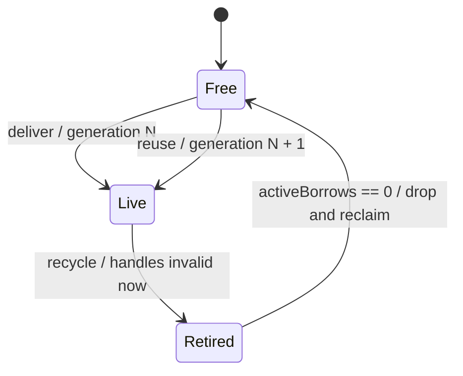

# 09 generational `PoolHandle<T>`、`PoolRef<T>` 与连续池化内存

> 状态：细化草案，等待人工确认。
>
> 硬依赖：[Canonical Place/CFG](./2026-07-18-01-canonical-type-place-cfg-artifact-design.md)、[borrow checker](./2026-07-18-02-reference-syntax-borrow-checker-design.md)、[ref struct/Span/layout](./2026-07-18-03-struct-ref-struct-span-layout-design.md)、[ownership/GC bridge](./2026-07-18-04-resource-ownership-drop-gc-bridge-design.md)。

## 1. 目标结果

对象池交付的不是实体本身，而是可长期流转、不会延长实体生命周期的 generational weak handle。访问时把 handle 验证并升级成短期、零重复检查的 direct ref view：

```text
PoolHandle<T> --tryBorrow--> PoolRef<T>
weak identity                scoped direct ref
```

目标：

- struct 实体以内联 slot 形式连续存储，不为每个实体分配 class/box。
- handle 只含 scalar identity，不进入 GC reference graph。
- recycle 立即使旧 handle 永久失效，slot reuse 延迟到活跃 direct ref 全部结束。
- `tryBorrow` 执行一次身份/状态检查；成功后的字段访问不重复检查 generation。
- GC 只在 TypeLayout 证明 `GcFree` 时跳过整段 slab；有 GC 字段时使用精确 map/barrier。
- pool 是标准库/运行时 capability，不增加 `pool` 关键字，也不在 compiler 中按 `PoolHandle` 名字特判。

## 2. 为什么必须拆成两个类型

weak handle 本身不包含语言 ref：

```zr
pub readonly struct PoolHandle<T> {
    pri let poolId: PoolId;
    pri let entityId: EntityId;
}
```

它可以合法存在于 class field、array、map、queue、artifact value 和 async frame。把它声明为 ref struct 只会无谓禁止这些数据结构，并不增加内存安全。

验证后的 view 才包含 ref：

```zr
pub readonly ref struct PoolRef<T> {
    pri let valueRef: ref T;
    pri let guard: PoolBorrowGuard;

    pub property value: ref T {
        pub get {
            return ref valueRef;
        }
    }
}
```

`PoolRef<T>` 不能进入 heap、box、普通 array、closure 或 suspension frame。它是 active borrow/guard 的值类型载体。

`readonly ref struct`表示`valueRef/guard`字段绑定不能被替换，不表示referent只读。PoolRef TypeDef声明`writableRefView` capability，getter contract记录`exportsWritableRef`；PoolReadRef只记录readonly ref export。普通readonly class不能使用该view capability绕过readonly。

## 3. Public API 形态

标准库位于 `zr.pooling`：

```zr
let pooling = import("zr.pooling");
```

```zr
module zr.pooling;

pub class Pool<T> where T: struct {
    pub fn deliver(value: T): PoolHandle<T>;
    pub fn tryBorrow(handle: PoolHandle<T>, view: out PoolRef<T>): bool;
    pub fn tryRead(handle: PoolHandle<T>, view: out PoolReadRef<T>): bool;
    pub fn recycle(handle: PoolHandle<T>): bool;
}

pub readonly ref struct PoolReadRef<T> {
    pri let valueRef: ref readonly T;
    pri let guard: PoolReadGuard;

    pub const property value: ref readonly T {
        pub get {
            return ref valueRef;
        }
    }
}
```

使用：

```zr
let handle = particlePool.deliver(init Particle(...));

var particle: PoolRef<Particle>;
if (particlePool.tryBorrow(handle, out particle)) {
    particle.value.position.x += 1.0;
}

particlePool.recycle(handle);
```

API 可以提供 throwing/required 变体，但规范基础是 `bool + out ref-like view`；失效 weak handle 是正常状态，不默认抛异常。失败路径把out view初始化为不可解引用的default值，满足definite-assignment且其guard drop为no-op。

第一版不写`Option<PoolRef<T>>`：当前泛型规则不允许ref struct作为普通generic argument，也不为pool提前引入C# `allows ref struct` anti-constraint。Try/out复用统一out contract且不分配wrapper。

## 4. Identity、状态与 ABA

```text
PoolId
  runtime/process-unique pool generation

EntityId
  slotIndex
  generation
```

完整身份：`PoolId + slotIndex + generation`。

状态机：



规则：

- deliver 在 slot 完成初始化后才发布 handle。
- recycle 使用完整 identity compare；重复 recycle/旧 generation 返回 false。
- Live -> Retired 的瞬间，后续所有 `tryBorrow/tryRead` 失败。
- slot reuse 必须获得新 generation；旧 handle 永不再次匹配。
- generation 即将回绕时永久退役 slot，或切换到不会在进程生命周期回绕的宽 identity。
- PoolId 防止另一个 pool 的同 index/generation handle 被误接收。

## 5. 活跃 borrow 与延迟复用

不能同时提供“立即复用 slot”和“既有 ref 零检查继续访问”。规范选择 retirement：

1. `tryBorrow` 验证 Live identity。
2. acquire read/write guard，再次确认状态未跨越 recycle transition。
3. 生成 `ref T` 或 `ref readonly T`。
4. recycle 原子/域内地标记 Retired，使新 borrow 失败。
5. 已获得的 PoolRef 保持旧实体有效，直至 guard drop。
6. active read/write guards 归零后执行 T 的 Drop/clear plan，并把 slot 放回 free list。

actor/thread-local pool：

- guard counter/state transition 使用非原子普通整数。
- isolation domain 静态禁止跨线程 handle upgrade/recycle。

concurrent pool：

- 使用 atomic state/count、epoch 或 hazard contract。
- memory ordering 进入 pool runtime capability，不能根据运行时偶然跨线程而切换模式。

## 6. Borrow 规则

- 任意数量 `PoolReadRef<T>` 可以共存。
- 同一实体最多一个 `PoolRef<T>` writable guard。
- writable guard 活跃时，不允许 read/write guard。
- read guard 活跃时，不允许 writable guard。
- recycle 可以把状态标为 Retired，但不得物理 drop/reuse active referent。
- `PoolRef` move 只移动 view/guard，不移动 slot 中的 T。
- guard field 使 PoolRef move-only；源 move 后不可继续访问。
- Drop/异常/早返回由 CFG cleanup 保证 guard release。

runtime guard 是跨 alias/recycle API 的实体状态协调，不是通用语言 borrow table。局部 `PoolRef.value` 派生引用仍由普通 static borrow checker 检查。

## 7. ref property 与 setter

PoolRef 使用 getter-only ref property：

```zr
pub property value: ref T {
    pub get {
        return ref valueRef;
    }
}
```

语义：

```zr
poolRef.value = replacement;          // Store T into current slot
let alias: ref T = ref poolRef.value; // reborrow current slot
poolRef.value = ref other;            // illegal: no ref setter
```

ref-return property 第一版一律禁止 set/init。重新指向另一个实体时，取得新的 PoolRef 并替换整个 `var` binding：

```zr
var current: PoolRef<Particle>;
require(particlePool.tryBorrow(first, out current));

var next: PoolRef<Particle>;
require(particlePool.tryBorrow(second, out next));
current = next;
```

RHS 完整验证成功后，结束旧 guard，再 move 新 view。不会出现 ref 已换而 guard/root 仍属于旧 slot 的部分状态。

极少数 cursor 重定向 API 使用显式 `rebind(ref target)` method，并接受普通 region checker；不把 ref rebind 隐藏在 assignment/property setter 中。

## 8. 连续存储与稳定引用

推荐 pool 使用 fixed-size slab/segment：

```text
Pool<T>
  slab directory
  free/retired lists
  generations[]
  states/borrowCounts[]

Slab<T>
  inline slots: T[N]
  initialization bitmap
  optional GC card/mark data
```

- active slot 不因 pool 扩容移动；扩容增加 slab，不替换 active slab storage。
- `ref T` 表示为 managed slab base + slot offset，或等价 backend handle。
- moving GC 中 base handle 在 compact 后更新；不能把 managed interior ref 长期降为裸 pointer。
- native/ownership slab 使用稳定 allocation；需要移动时必须等待全部 active guards 结束。
- no live handle/ref 指向 uninitialized/free slot。

这比“pool manager 的强引用”更严格：真正稳定来源是具体 slab + slot state，而不是可能替换内部数组的 facade object。

## 9. GC 扫描分类

TypeLayout 自动计算：

```text
GcScanKind
  GcFree       no GC references in T
  GcMapped     immutable/known precise GC offsets
  GcBarriered  mutable GC reference fields need barriers/cards
```

### 9.1 `GcFree`

- slab 标记 NoScan。
- PoolHandle 只有 scalar IDs，也标记 GcFree。
- GC 不遍历每个实体，不需要 per-slot object header。
- 这是访问加速和降低 GC 负担的首选 pool element category。

### 9.2 `GcMapped/GcBarriered`

- 长期存活不代表可以跳过扫描。
- GC 通过 TypeLayout pointer map 扫描 initialized live/retired slots。
- mutable GC field store 必须经过 write barrier/card marking。
- old slab 指向 young object 时依赖 remembered set；不能用“pool 永久存活”替代。
- free/uninitialized slot 不得保留未清理的 GC pointer bits。

用户 annotation 不能谎报 `GcFree`。classification 由 closed T 的 canonical layout 递归计算，并进入 artifact layout hash。

## 10. struct、class 与 resource storage

### 10.1 struct

fixed-layout struct 可以 inline 存入 slab：

- 无 per-item GC allocation/header。
- stride/align 由 TypeLayout 决定。
- 适合 ECS、particle、network packet、render command 等数据导向结构。

### 10.2 ordinary class

普通 class 放进“对象池”通常仍是独立 GC object。池只减少重复创建，不自动取消：

- object header/identity。
- GC tracing/compaction。
- class 内部引用图。
- 离散分配。

需要真正 inline continuous storage 时应改用 struct + PoolHandle identity，而不是假设 class pooling 等价于 value slab。

### 10.3 resource/own class

逐个 `own` 分配发生在 ownership heap/arena，不是栈；它可能造成 heap external fragmentation。resource pool/size-class slab 可以批量管理 storage，但仍必须执行确定 Drop contract。

若 resource 实体通过 weak handle 交付：

- pool 是唯一 owner。
- recycle/reclamation 阶段执行 resource Drop。
- PoolRef 只提供 borrow，不转移 owner。
- pool drop 必须先停止发布、retire live entities、等待 guards，再逆序/按 slot plan drop。

## 11. 语言基础层承载方式

pool 不新增 syntax AST 或专用 `PoolBorrow` opcode。普通基础层已经足够：

- PoolHandle 是 ordinary canonical struct TypeRef。
- `tryBorrow` 是带 runtime validation/effect contract 的 resolved call。
- PoolRef 是 ref-like TypeDef，layout 含 ref map + drop/guard field。
- `value` getter lower 为 PropertyRefGet -> RefValue -> Place。
- guard drop 使用普通 Drop/CFG cleanup。
- derived ref 的 escape upper bound 不宽于 PoolRef value。
- call完成acquire后，PoolRef的RefValue region锚定guard/slab slot，不维持对Pool facade receiver的普通loan；因此recycle可以把实体标为Retired，但StableSlotSource contract保证active guard期间不物理reclaim。

runtime capability metadata：

```text
StableSlotSourceContract
  identityType
  validateFunction
  acquireRead/acquireWrite
  releaseFunction
  refProjection
  retirementPolicy
  isolation/concurrency domain
```

compiler 只验证这个通用 contract，不比较 `Pool`、`PoolHandle`、`PoolRef` 名字。

## 12. Artifact、reflection 与 LSP

artifact 保存：

- PoolHandle/PoolRef 的普通 TypeDef/layout/copy/drop/ref-like flags。
- closed T 的 GcScanKind、layout hash、drop contract。
- tryBorrow callable effect/escape contract。
- StableSlotSource capability id/contract hash。
- isolation/concurrency requirement。

不保存运行时 PoolId、slot generation、borrow count 或 free list。

reflection：

- 可以查询 PoolHandle/PoolRef 类型和 layout category。
- 不能 box/动态构造 PoolRef。
- 不暴露可绕过 generation/guard 的 refProjection invocation。
- debug 只能在 active frame/guard 中展示 PoolRef referent。

LSP：

- hover 区分 `PoolHandle<T> weak identity` 与 `PoolRef<T> scoped writable ref`。
- 在 handle 上建议 `tryBorrow/tryRead`，不直接补全 T member。
- ref property显示 getter-only和 region/guard来源。
- 跨 await 保存 PoolRef 给出“保存 handle/lease，恢复后重新 borrow”的 code action guidance。

## 13. 诊断

至少包括：

```text
pool.handle_wrong_pool
pool.handle_stale
pool.entity_retired
pool.borrow_conflict
pool.concurrent_capability_required
pool.generation_exhausted
pool.ref_escape
pool.ref_across_suspension
pool.ref_property_has_setter
pool.layout_not_poolable
```

stale/retired 是 `tryBorrow` 的正常 `false` 结果；required/throwing API 才产生 structured error。debug build 可以记录 issue/recycle site，但 release correctness 不依赖全局 runtime borrow stack。

## 14. 测试矩阵

### Identity/state

- first generation、recycle、double recycle、slot reuse、old handle永久失败。
- wrong PoolId、pool destroyed/reloaded、generation near wrap。
- deliver construction throw 不发布 handle，只清理 initialized fields。

### Borrow/reclamation

- multiple readers、single writer、read/write conflict。
- recycle during active read/write：新 borrow失败，旧 borrow有效，最后 guard释放后复用。
- early return/throw/break/continue 清理 guard。
- replacing `var PoolRef` 的 evaluate/drop/move 顺序。
- ref getter派生 loan阻止 guard/whole view提前 drop。

### Memory/GC

- GcFree slab 不进入 mark scan且无 stale pointer bits。
- GcMapped precise offsets、GcBarriered old-to-young card。
- compact 后 managed base+offset ref仍访问同一实体。
- resource T Drop exactly once、partial initialization cleanup。
- empty/one/full slab、跨 slab扩容、alignment/padding/large T。

### Performance/stress

- 100万 handle validate/reject、hot successful borrow、direct field loop。
- recycle/reuse churn、free-list pressure、generation table locality。
- 与 per-item class allocation 的 allocation count、GC pause/scan bytes 对比。
- GcFree 与 GcMapped slab 分别统计 scan bytes，禁止把结果混合。
- thread-local non-atomic与 concurrent atomic pool单独 benchmark。

## 15. 参考依据与差异

- CPython arena/pool/size class：`lua/cpython/Include/internal/pycore_obmalloc.h`、`lua/cpython/Objects/obmalloc.c`。
- .NET Span/managed byref：`lua/runtime/src/libraries/System.Private.CoreLib/src/System/Span.cs`、`ByReference.cs`。
- C# ref struct/ref field escape tests：`lua/roslyn/src/Compilers/CSharp/Test/Semantic/Semantics/RefEscapingTests.cs`、`RefFieldTests.cs`、`SpanStackSafetyTests.cs`。
- Rust pin/address stability与move限制：`lua/rust/library/core/src/pin.rs`。
- Rust borrow/move/drop failure coverage：`lua/rust/tests/ui/borrowck`、`moves`、`drop`。
- QuickJS GC mark/barrier precedent：`lua/QuickJS-master/quickjs.c`。

ZR 的刻意差异是：weak identity handle 是普通可存储 struct；只有验证后的 direct reference 是 ref struct。与每次 handle access 都做 generation check 的 ECS 实现相比，ZR 提供 `tryBorrow` 一次验证 + guard 延迟复用，以换取 hot field access 的零重复检查。
