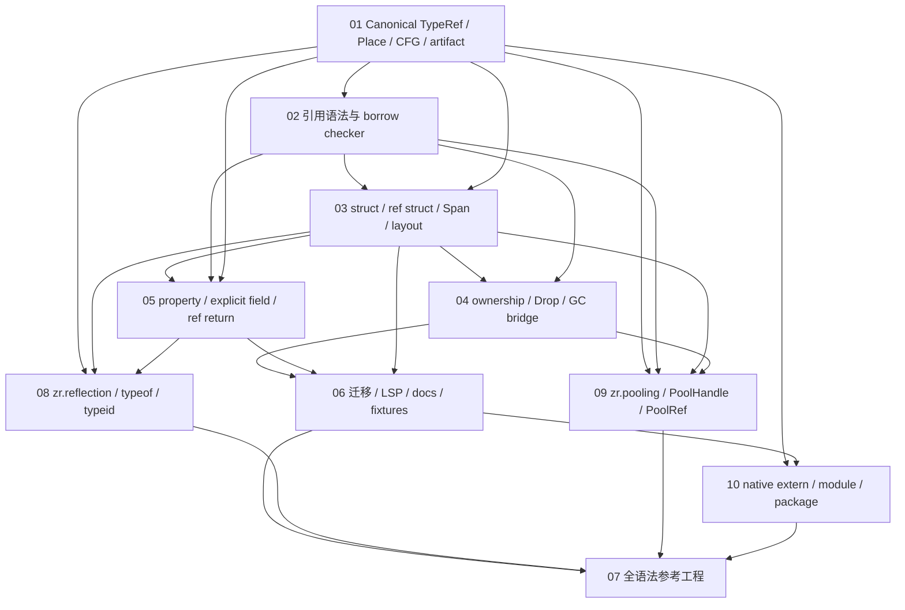

# ZR 语法重设计子计划索引

> 状态：总设计已批准；本目录中的十份细化设计按依赖顺序实施。
>
> 总设计：[ZR 语法、引用与内存模型重设计](./2026-07-18-zr-syntax-and-memory-model-redesign.md)

## 1. 目的

本目录把总设计拆成十个依赖有序、可以独立验收的设计单元。拆分的目标不是让多条实现线并行绕过基础层，而是让每个单元都具有清晰输入、输出和晋级门。

## 2. 设计文档

| 顺序 | 文档 | 主要产物 | 硬依赖 |
|---:|---|---|---|
| 1 | [Canonical TypeRef、Place IR、CFG facts 与 artifact schema](./2026-07-18-01-canonical-type-place-cfg-artifact-design.md) | 规范类型、Place/Value IR、数据流事实、产物契约 | 无 |
| 2 | [`fn/ref/in/out/scoped/readonly` 与 borrow checker](./2026-07-18-02-reference-syntax-borrow-checker-design.md) | 新语法、引用契约、借用检查、诊断 | 1 |
| 3 | [struct/ref struct、receiver effect、Span 与 layout](./2026-07-18-03-struct-ref-struct-span-layout-design.md) | `init TypeRef(...)` 值构造、值布局、ref-like 限制、receiver effect、连续视图 | 1、2 |
| 4 | [resource class、Unique/Shared/Weak、Drop 与 GC bridge](./2026-07-18-04-resource-ownership-drop-gc-bridge-design.md) | 确定性生命周期、引用计数、drop glue、跨世界桥 | 1、2、3 的布局契约 |
| 5 | [property 统一 AST、显式字段与 ref-return property](./2026-07-18-05-property-unified-ast-design.md) | 统一属性模型、访问器、显式 `let/var` field、ref 返回 | 1、2、3 的 receiver/layout 契约 |
| 6 | [`%xxx` 迁移、LSP、文档与全项目 fixture](./2026-07-18-06-percent-migration-lsp-fixtures-design.md) | 迁移工具、编辑器表现、规范切换、仓库收口 | 1-5 |
| 7 | [目标语法全覆盖参考工程](./2026-07-19-07-comprehensive-syntax-reference-fixture-design.md) | 单一多模块正例、负例目录、coverage manifest、VM/AOT/artifact/LSP 验收参考 | 1-6、8、9 |
| 8 | [`zr.reflection` 独立反射库与运行时类型系统](./2026-07-19-08-reflection-library-type-system-design.md) | Type/TypeOf层级、成员查询、typeof/typeid、动态构造、metadata/AOT边界 | 1、3、5 |
| 9 | [generational PoolHandle/PoolRef 与连续池化内存](./2026-07-19-09-generational-pool-handle-ref-struct-design.md) | 弱handle、guarded direct ref、延迟复用、slab/GC scan contract | 1-4、5 的 ref property契约 |
| 10 | [Native extern、内建库、模块与包解析](./2026-07-19-10-native-ffi-module-package-design.md) | FfiSignature、`zr.xxx` inventory、ModuleSpecifier/Identity、`.zrp/.zrm` | 1、6 |

## 3. 依赖关系

第 4、5 项在第 1-3 项稳定后可以分别实施；第 8、9 项分别把reflection和pooling建立在这些通用contract上，第10项统一native/module/package边界。第6项的正式切换必须等待受影响的下层能力通过。第7项是目标语法的纵向验收与设计样例，只有1-6、8-10的相应contract已冻结后，才能把对应代码块晋级为current fixture。

## 4. 共同约束

十份设计共同遵守以下规则：

1. AST 只记录语法，不承担规范类型、借用状态或运行时所有权状态。
2. Semantic IR 必须在 ExecBC/bytecode 之前形成；不能从执行指令反推语言语义。
3. VM、AOT、LSP、反射和 artifact writer 消费同一规范 TypeId、SymbolId、Place/Region facts 或其稳定投影。
4. shared foundation 不允许通过 `Span`、`Unique` 等具体类型名字符串触发特例。
5. borrow、move、readonly、ref struct 逃逸和 `out` 确定赋值必须静态完成。
6. 数组越界、Weak upgrade、动态 cast 和 native 输入等无法静态证明的状态仍保留运行时检查。
7. 每个里程碑先验证下层单元，再验证父层，最后验证项目和 CLI；上层 smoke 不能替代下层测试。
8. `.zro` 中只保存跨模块所需的稳定类型、布局和公开契约；局部 flow facts 默认只进入 `.zri` 和调试 sidecar。
9. 总设计中已经批准的 `const fn` 只读 receiver、普通 `fn` 可写 receiver 是所有子设计的共同前提。
10. 旧 `%xxx` 只允许存在于迁移输入、负例和历史文档中，不保留长期双轨语义。
11. 命名/匿名函数定义以 `:` 引出 return TypeRef，callable 类型以 `->` 表示输入到输出，`=>` 只引出 anonymous/expression body；返回 callable 写作 `fn make(...): fn(A) -> R`。
12. struct 值构造使用 `init TypeRef(...)`；普通 `expr(...)` 只执行 call/`@call`，旧 `$proto(...)` 动态原型构造退出核心语法。
13. 反射位于 `zr.reflection`；`typeid(TypeRef)` 是轻量身份，`typeof(expr)` 是运行时精确 descriptor。动态构造只通过 `ConstructibleType.createInstance(...constructionArgs: object): object`，不得回退到 `init`、`new`、`own` 或 `@call`。
14. 换行始终只是 trivia，不结束声明或语句，也不触发 automatic semicolon insertion。field/local/module/import binding、expression/assignment、`return/throw/break/continue`、bodyless declaration 和 expression accessor 等 simple form 必须显式以 `;` 结束。
15. 已由 `{ ... }` 闭合的 type/function/property等braced declaration可以省略一个尾随 `;`，规范 formatter默认省略；compound control-flow statement由完整`if/else`、`try/catch/finally`等grammar闭合，不消费declaration semicolon。若braced anonymous function是`let` initializer，结束的是外层binding，因此`}`后仍必须写`;`。
16. 静态导入使用模块级不可变绑定 `let alias = import("module.path");`。`import(...)` 是只接受 string literal 的专用 ImportExpression，返回只读 ModuleNamespace object并记录静态依赖；runtime path 使用 `loadModule/loadPlugin`，不进入该语法。
17. concrete property 不生成 backing field；存储必须预先用 `pri/pro/pub let|var` 显式声明。ref-return property是getter-only，不存在ref setter或`property = ref other`；writable ref getter以独立`exportsWritableRef` effect区分“view自身readonly”和“referent可写”。
18. 池化标准库位于 `zr.pooling`：`PoolHandle<T>` 是可长期保存的 generational weak identity，`tryBorrow(handle, out PoolRef<T>): bool` 单次验证并初始化scoped direct ref；不用非法的`Option<PoolRef<T>>`。recycle立即使handle失效，slot复用延迟到active guard归零。
19. 只有 Canonical TypeLayout 证明 `GcFree` 的 closed type/slab 可以 `NoScan`；长期持有、old generation 或 pool 标记不能替代 GC pointer map、write barrier 和 remembered set。
20. `let/var { ... } = expr;`与`let/var [ ... ] = expr;`保留；RHS只求值一次，object alias为`local: field`，array采用“至少N项、额外忽略、不足失败”，第一版不含default/rest/nested pattern。
21. static native declaration使用`native extern("library") { ... }`；语言 callable contract和ABI `FfiSignature`在绑定期一次形成，VM/AOT共享，`zr.ffi`不在每次静态调用时重解析字符串签名。
22. module literal先解析为ModuleSpecifier再规范化为ModuleIdentity；`.`和`/`可作为segment分隔，`.`/`..`相对前缀具有独立语义。`.zrp` alias只使用单段`#identifier`。
23. 第三方包名只允许单段`@identifier`。`@math`是package root/default entry，`@math.matrix`与`@math/matrix`是同一子模块；第一版不引入组织作用域包名或最长匹配。
24. 标准native库统一位于`zr.xxx`；当前裸`debug`迁移为`zr.debug`，reflection与pooling分别位于`zr.reflection`和`zr.pooling`。

## 5. 建议重点复核的细化决定

以下决定是在总方向下进一步具体化的内容，适合优先人工检查：

- 具体 struct 继承被取消，改用 interface 与组合，以保持内联布局稳定。
- readonly struct 内普通 `fn` 自动获得 readonly receiver；普通 class/struct 仍以 `const fn` 显式只读。
- `Shared<T>` 第一版非原子且不能跨线程，`AtomicShared<T>` 后续独立提供。
- `Unique<T>.intoGc()` 生成 `GcBox<T>` 并明确放弃确定性释放；Shared 不支持该转换。
- resource class 持有 GC 对象必须通过 `Gc<T>` root handle。
- concrete property 必须显式代理预先声明的 field；ref-return property 必须显式 getter，且不允许 set/init/auto backing。
- 正式 compiler 不执行旧语义，旧 parser 只保留在 migration frontend。
- struct 构造只接受静态 TypeRef 并直接降低为 destination-first `ValueConstruct`；runtime `Type` 必须先通过 `ConstructibleType` capability check 才能进入显式 `createInstance` boundary。
- `ConstructibleType.createInstance` 第一版只按位置绑定 public constructor；普通 class 返回 GC object，struct 返回 boxed object，并拒绝 resource class、ref struct、interface、abstract type 和 open generic。
- `PoolHandle<T>` 不因为语义上是 weak identity 就声明为 ref struct；只有包含 direct ref/guard 的 `PoolRef<T>` 受 ref-like 存储限制。
- enum/union variant和其他无独立 block 的 member declaration统一使用 `;`；不保留 comma/newline terminator双轨。
- import binding的 alias既是 module namespace symbol，也是运行时只读 module object；只有原始 immutable import binding可以在 TypeRef中限定 imported type，普通 object alias不能伪装成 type namespace。

## 6. 源码现状锚点

当前基础并非空白，但需要重新划分职责：

- `zr_vm_parser/include/zr_vm_parser/ast.h` 同时保存 passing mode、ownership qualifier、property 分裂节点和 receiver qualifier。
- 同一 AST 中的 `SZrConstructExpression.isNew/isUsing` 仍混合 `$`、`new` 与 ownership construct；目标设计要求拆成 `ValueConstruct`、`GcNew`、`OwnConstruct` 和普通 `Call`。
- `zr_vm_core/include/zr_vm_core/function.h` 中的 `SZrFunctionTypedTypeRef` 仍是扁平类型字段；现有 `SZrSemIrInstruction` 是执行指令 sidecar。
- `zr_vm_parser/include/zr_vm_parser/cfg.h` 的 block 仍以单个 AST statement 和最多两个 successor 为中心。
- `zr_vm_parser/include/zr_vm_parser/semantic_facts.h` 已有 TypeId、SymbolId、LifetimeRegionId 和数据流 facts，可作为查询层基础。
- `zr_vm_core/include/zr_vm_core/type_layout.h` 已有 byte size/alignment、field offsets、GC/ownership offsets 和 copy/drop kind。
- `zr_vm_core/include/zr_vm_core/metadata_token.h` 已有 TypeDef、TypeRef、TypeSpec、Signature token 与 layout hash。
- `zr_vm_core/include/zr_vm_core/ownership.h` 已有 unique/shared/weak/borrow/loan/detach/release runtime 入口，但需要按新模型删减并分层。
- `zr_vm_language_server` 已经消费 semantic facts；迁移目标是扩充统一查询，而不是在 LSP 内重做类型和借用判断。

## 7. 晋级规则

每份文档都提供自己的 promotion gate。共同最低门槛为：

- 枚举全部公开语法和规范 IR 形态。
- 覆盖成功、边界、失败和诊断范围。
- 覆盖 VM 与 AOT 的等价行为。
- 覆盖 `.zrs/.zri/.zro` 中受影响的产物。
- 覆盖 LSP 或明确说明该阶段为何只提供 query facts。
- 不存在 concrete type-name dispatch 或临时表层拼写特判。
- 未覆盖项必须保持里程碑 open，不能以“后续补测试”晋级。

## 8. 文档优先级

设计解释发生冲突时按以下顺序处理：

1. 已确认的子设计文档。
2. 总设计文档。
3. `docs/zr_language_specification.md` 当前版本。
4. `.codex/plans/` 中被本设计替代的历史计划。

在第 6 项完成前，正式语言规范仍描述当前可执行语法；子设计是目标规范，不应被误写成当前版本已经支持的能力。
