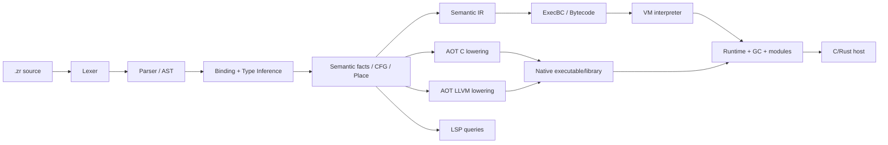

---
related_code:
  - CMakeLists.txt
  - zr_vm_common/include/zr_vm_common.h
  - zr_vm_core/include/zr_vm_core.h
  - zr_vm_parser/include/zr_vm_parser.h
  - zr_vm_library/include/zr_vm_library.h
  - zr_vm_aot/zr_vm_parser/src/zr_vm_parser/backend_aot/backend_aot.c
  - zr_vm_language_server/include/zr_vm_language_server.h
  - zr_vm_rust_binding/include/zr_vm_rust_binding.h
implementation_files:
  - CMakeLists.txt
  - zr_vm_core/src/zr_vm_core
  - zr_vm_parser/src/zr_vm_parser
  - zr_vm_library/src/zr_vm_library
plan_sources:
  - user: 2026-09-09 在 docs/wiki 构建完整 ZrVm 说明书
  - docs/plans/aot/index.md
  - docs/plans/syntax/README.md
tests:
  - tests/fixtures/projects/hello_world/hello_world.zrp
  - tests/fixtures/projects/syntax_reference_v1/syntax_reference_v1.zrp
  - tests/CMakeLists.txt
doc_type: module-detail
---

# 系统概览

**状态：`current`（AOT/LSP 的部分能力标为 `experimental`）**

ZrVm 是一个用 C11 实现的 ZR 语言执行平台。它把同一套源语言语义投影到解释器、预编译 binary、AOT C 和 AOT LLVM 路径，并通过 native module registry、C API、Rust binding、CLI 和 LSP 对外提供宿主能力。

## 设计目标

- **静态语言表面**：显式类型、函数签名、泛型、属性、模块和结构化诊断。
- **两种内存世界**：普通对象由 GC 管理；资源对象使用 `Unique<T>`、`Shared<T>`、`Weak<T>` 和确定性 Drop。
- **后端一致性**：parser 先形成 Canonical Type/Place/CFG/Semantic facts，VM 和 AOT 只消费这些事实，不从 AST 拼写或类型名字符串猜语义。
- **可嵌入**：宿主可以创建 `SZrGlobalState`/`SZrState`，挂接文件、native、AOT loader 和日志回调。
- **工具友好**：LSP 查询复用 parser 产生的稳定 `SymbolId`、`TypeId`、`PlaceId` 和 revision，避免编辑器与编译器各自推断。

## 分层架构

### `zr_vm_common`

定义跨模块 ABI、基础类型别名（`TZrSize`、`TZrInt64` 等）、编译配置、指令/对象/路径/运行时限制常量和导出宏。该层不依赖 VM 对象，适合被所有模块包含。

### `zr_vm_core`

提供 `SZrGlobalState`、`SZrState`、栈和 `SZrCallInfo`、值与对象、原型/成员描述符、模块、函数/闭包、异常、GC、字符串、反射、执行和调用绑定。它是运行时语义的承载层。

### `zr_vm_parser`

实现 lexer、parser、AST、Canonical Type graph、类型推断、CFG/dataflow、Semantic IR、编译器、属性/comptime、诊断和 artifact writer。它依赖 core 和 library 的公开契约；AOT backend 源码由 `zr_vm_aot` 提供并在 parser target 中编译。

### `zr_vm_library`

提供项目/文件加载、`.zrp`/`.zrm` 处理、native binding descriptor、native registry、AOT runtime helper 和公共宿主状态构造。

### `zr_vm_lib_*`

标准 native provider 按能力拆分：`system`、`math`、`container`、`iteration`、`ffi`、`task`、`thread`、`testing`、`debug`、`network`。每个 provider 以 `ZrVm..._Register` 注册 `ZrLibModuleDescriptor`。

### `zr_vm_cli`、`zr_vm_language_server`、`zr_vm_rust_binding`

CLI 负责项目编译、运行、测试、AOT、调试、profile 和 coverage；语言服务器提供 stdio、WASM 和编辑器查询；Rust binding 将项目、session、budget、checkpoint、native module 和值操作包装为稳定 C ABI，再由 Rust crate 安全封装。

## 一次执行的生命周期

1. 宿主创建 global，配置 allocator、source loader、native/AOT loader 和日志。
2. 从 `.zrp` 项目 manifest 得到 entry module、依赖、feature、输出目录和 AOT 模式。
3. loader 解析 module identity，优先读取 source 或 `.zro`，并验证 artifact identity、signature/layout hash。
4. parser 对源文件执行词法、语法、绑定、类型/CFG 分析，生成 function graph 与 Semantic IR。
5. compiler 生成 ExecBC/bytecode；binary writer 写出 `.zri`（中间/索引信息）和 `.zro`（可运行模块产物）。
6. VM 通过 `SZrCallInfo` 建立 frame，执行指令；native call 经过 `ZrLibCallContext` 和 GC root/pin 保护。
7. AOT 模式把同一 canonical facts 降为 C/LLVM 函数、frame/layout metadata 和 runtime call；运行时仍负责异常、GC、模块和动态边界。
8. entry 返回 `SZrTypeValue` 或设置结构化错误；宿主销毁 session/state/global，最后释放 provider registration。

## 关键不变量

| 不变量 | 说明 |
|---|---|
| 身份稳定 | 模块、类型、函数和调用站点使用 token/hash/generation；不会把进程地址写进 artifact。 |
| 语义单一来源 | LSP、VM、AOT、反射和 writer 使用同一 canonical facts 或其 versioned projection。 |
| 显式所有权 | `.`/`?.` 是普通目标访问；`share/degrade/wake/intoGc/drop` 才是 ownership intrinsic。 |
| 失败可观察 | 诊断包含稳定 code、位置、原因和建议；loader、ABI、预算和 GC 失败不静默降级。 |
| 下层优先 | parser/semantic/core 契约必须先通过，不能用 CLI smoke 代替底层验证。 |

## 平台与构建边界

顶层 CMake 使用 C11。默认构建 shared library、CLI、测试和已启用的标准 provider；`BUILD_NETWORK_LIB`、`BUILD_THREAD_LIB`、`BUILD_LANGUAGE_SERVER`、`BUILD_RUST_BINDING`、`BUILD_LANGUAGE_SERVER_EXTENSION` 等选项可关闭。Windows 使用 MSVC，Unix 使用 GCC/Clang；Linux 还会链接 `Threads`、`m`、bundled third-party libraries。

`zr_vm_aot` 是 parser 的 AOT backend 源码树，不是一个独立的顶层 CMake module；parser target 会把 backend sources 加入静态/共享库。WASM 语言服务器会把必要的 core/parser/library/provider 源码直接编入 Emscripten target。

## 不应做的假设

- `README.md` 中的示例不等于每个后端都已完整实现；以对应测试和状态矩阵为准。
- 规划文档中的目标 ABI 不自动成为稳定 ABI。
- native descriptor 的 `documentation`/显示签名不能替代结构化类型和 passing-mode contract。
- 旧 `%module`、`%owned`、`func` 等迁移语法不能进入生产 AST 或 lowering。
