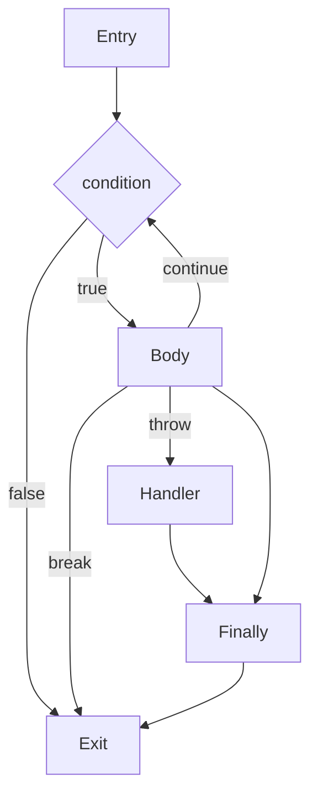

---
related_code:
  - zr_vm_parser/include/zr_vm_parser/cfg.h
  - zr_vm_parser/include/zr_vm_parser/semantic_ir.h
  - zr_vm_parser/include/zr_vm_parser/semantic_facts.h
  - zr_vm_parser/src/zr_vm_parser/type_inference/cfg.c
  - zr_vm_parser/src/zr_vm_parser/type_inference/cfg_control_flow.c
  - zr_vm_parser/src/zr_vm_parser/type_inference/dataflow.c
  - zr_vm_core/include/zr_vm_core/state.h
  - zr_vm_core/include/zr_vm_core/exception.h
  - zr_vm_core/src/zr_vm_core/exception.c
  - zr_vm_core/src/zr_vm_core/execution/execution_dispatch.c
  - zr_vm_core/src/zr_vm_core/execution/execution_control.c
  - zr_vm_core/src/zr_vm_core/closure.c
implementation_files:
  - zr_vm_parser/src/zr_vm_parser/type_inference/cfg.c
  - zr_vm_parser/src/zr_vm_parser/type_inference/dataflow.c
  - zr_vm_core/src/zr_vm_core/exception.c
  - zr_vm_core/src/zr_vm_core/execution/execution_control.c
tests:
  - tests/parser/test_cfg_reachability.c
  - tests/parser/test_cfg_constant_conditions.c
  - tests/parser/test_cfg_switch_constants.c
  - tests/parser/test_cfg_finally_abrupt.c
  - tests/parser/test_cfg_try_catch_edges.c
  - tests/parser/test_cfg_throw_effects.c
  - tests/parser/test_cfg_typed_catch_flow.c
  - tests/parser/test_union.c
  - tests/exceptions/test_exceptions.c
plan_sources:
  - user: 2026-09-09 在 docs/wiki 构建完整 ZrVm 说明书
  - docs/plans/syntax/2026-07-18-01-canonical-type-place-cfg-artifact-design.md
  - docs/plans/syntax/2026-07-18-04-resource-ownership-drop-gc-bridge-design.md
doc_type: module-detail
---

# 控制流、异常与清理

**状态：`current`**

## 控制流模型

parser 先把语句转换为 CFG block/edge；每条 edge 带正常、异常、return、break、continue 或 finally transfer 语义。dataflow 在 CFG 上计算 reachability、definite assignment、reaching definition、borrow/loan liveness 和 constant condition facts。



`if`、`while`、C-style `for` 和 foreach 都产生显式 block；常量条件只影响 reachability fact，不会在 parser 中偷偷删除语义节点。ExecBC 可以做受证明的 superinstruction 融合，但 `.zri`/AOT artifact 保留原始语义 opcode。

## 条件与循环

```zr
if (ready) { start(); } else { reset(); }

while (hasNext()) {
    let item = next();
    if (item.isInvalid()) { continue; }
    if (item.isEnd()) { break; }
}
```

`break`/`continue` 只能跳到所属 loop 的目标 block；跳转前先运行当前 scope 的 Drop/Close cleanup。循环条件中的类型转换和短路逻辑也进入 dataflow，不能依赖运行时 truthiness 猜测未初始化值。

## switch、enum 与 union

```zr
union Result {
    Ok(value: int);
    Error(message: string);
}

fn unwrap(result: Result): int {
    switch (result) {
        (Result.Ok(value)) { return value; }
        (Result.Error(message)) { throw message; }
    }
}
```

编译器检查 variant tag、payload shape、pattern arity/field 名和穷尽性。不可达分支会发布诊断；缺失 variant 不会在运行时静默落到默认分支，除非 union 明确声明 fallback variant。

## 异常状态机

`SZrState` 保存 `currentException`、`currentExceptionStatus`、`exceptionHandlerStack` 和 `pendingControl`。每个 handler 有 TRY/CATCH/FINALLY phase、protected range、catch targets、finally target 和 after-finally target。

```zr
try {
    operation();
} catch (error: IOError) {
    recover(error);
} finally {
    release();
}
```

执行过程：

1. `try` 注册 handler 并进入 protected range。
2. `throw` 写入 current exception，沿 call-info 链查找类型匹配的 catch。
3. 离开 protected range 时先执行 scope cleanup，再进入 catch 或 finally。
4. finally 完成后恢复原 pending control（exception/return/break/continue）或报告 finally 的新异常。
5. 无 handler 时展开 frame、关闭 closure/resource、更新 thread status 并交给宿主。

native callback 不能通过 longjmp 绕过 runtime contract；应使用 `ZrCore_Exception_TryRun`/continuation 约定返回状态。AOT runtime 提供 `Try`、`EndTry`、`Throw`、`Catch`、`EndFinally` 和 `SetPending*` 对等 helper。

## cleanup、using 与 Drop

`resource` owner 的 Drop、`using` 的 Close/Dispose 和 GC finalization 是三种不同 contract。任何正常结束或异常控制转移都必须穿过 cleanup CFG：

```text
scope enter -> body -> mark-to-be-closed/drop list
           -> return/throw/break/continue edge
           -> close/drop in reverse order
           -> resume original control
```

`MARK_TO_BE_CLOSED`/`CLOSE_SCOPE` 是当前执行层的 cleanup 指令；ownership intrinsic 不应重新承载 using 语义。cleanup 失败保留原 pending control，并让宿主看到真实异常；不能只在正常 scope exit 测试。

## 确定赋值与借用

在声明初始化器内部读取自身，状态仍是 `UNINIT`；分支汇合后可能是 `MAYBE_INIT`。`out` 只在 callee 正常返回边上变为 `INIT`。借用冲突按 Place/region 判断，不能用变量名字符串替代。

```zr
var value: Data;
if (tryCreate(out value)) {
    use(value);       // INIT on this edge
}
```

错误包括未初始化读取、move 后使用、同时可写借用、ref-like escape、不可达 break/continue、非穷尽 switch、catch 类型不匹配和 finally 控制流冲突。

## C 接口与诊断

核心异常入口位于 `zr_vm_core/exception.h`，控制流和状态入口位于 `state.h`：

| API | 作用 |
|---|---|
| `ZrCore_Exception_TryRun` | 在受保护边界执行 native/VM callback，返回 `EZrThreadStatus`。 |
| `ZrCore_Exception_Throw`（按头文件实际声明调用） | 设置当前异常并启动展开。 |
| `ZrCore_State_ResetThread` | 清理异常状态并设定 thread status。 |
| `ZrCore_State_DoRun` | 从 entry 名称运行当前 state。 |
| `ZrCore_Closure_CloseRegisteredValues` | 展开时关闭指定数量的 open closure values。 |
| `ZrCore_Gc_SafePoint` | cleanup/异常边界上的 GC 协作点。 |

结构化 compiler diagnostic 应包含 stable code、source range、cause 和 suggestion；legacy error callback 只作为兼容输出，不是 LSP/IDE 的事实来源。
