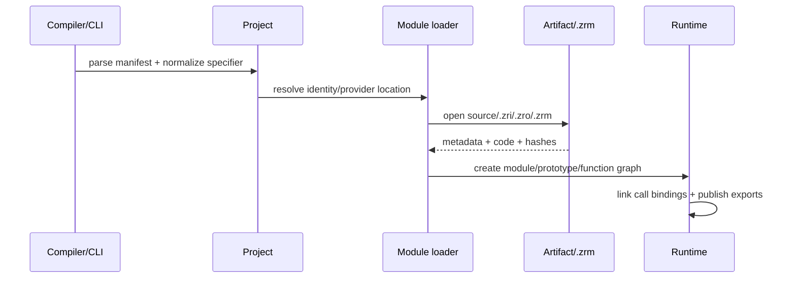

---
related_code:
  - zr_vm_common/include/zr_vm_common/zr_path_conf.h
  - zr_vm_library/include/zr_vm_library/project.h
  - zr_vm_library/include/zr_vm_library/zrm.h
  - zr_vm_library/include/zr_vm_library/file.h
  - zr_vm_core/include/zr_vm_core/module.h
  - zr_vm_core/include/zr_vm_core/io.h
  - zr_vm_core/include/zr_vm_core/artifact_schema.h
  - zr_vm_core/include/zr_vm_core/metadata_token.h
  - zr_vm_core/include/zr_vm_core/metadata_runtime.h
  - zr_vm_parser/include/zr_vm_parser/writer.h
  - zr_vm_core/src/zr_vm_core/module/module_loader.c
  - zr_vm_core/src/zr_vm_core/module/module.c
  - zr_vm_library/src/zr_vm_library/project/project.c
  - zr_vm_library/src/zr_vm_library/zrm.c
  - zr_vm_parser/src/zr_vm_parser/writer.c
implementation_files:
  - zr_vm_library/src/zr_vm_library/project/project.c
  - zr_vm_core/src/zr_vm_core/module/module_loader.c
  - zr_vm_core/src/zr_vm_core/module/module.c
  - zr_vm_core/src/zr_vm_core/artifact_schema.c
  - zr_vm_parser/src/zr_vm_parser/writer.c
tests:
  - tests/module/test_module_system.c
  - tests/library/test_project_module_specifier.c
  - tests/parser/test_artifact_schema.c
  - tests/parser/test_call_binding_artifact.c
  - tests/library/test_zrm_container.c
  - tests/fixtures/projects/import_basic
  - tests/fixtures/projects/import_binary
  - tests/fixtures/projects/binary_module_graph_pipeline
plan_sources:
  - user: 2026-09-09 在 docs/wiki 构建完整 ZrVm 说明书
  - docs/plans/syntax/2026-07-19-10-native-ffi-module-package-design.md
  - docs/module-system/zrm-assembly-container.md
doc_type: module-detail
---

# 模块、项目与产物

**状态：`current`；`.zrm` package/provider 和部分 AOT relocation 为 `experimental`。**

## 模块身份

模块身份不是文件名，也不是进程中的对象地址。`SZrLibrary_ModuleIdentity` 由 domain、规范化 segments 和 packageName 组成；module loader 还校验 assembly/version、provider phase、module signature hash 和 artifact identity。

官方根 `zr.*` 由 native registry 保留，workspace、alias、package 或自定义 provider 不能覆盖。`native:engine.render` 与 workspace 的 `engine.render` 即使文本相似，也是不同 domain/identity。

## import 形式

```zr
let system = import("zr.system");
let local = import("./math/vector");
let parent = import("..shared.types");
let aliased = import("#graphics/render");
let packageModule = import("@math/matrix");
let external = import("file:///opt/sdk/physics.zrm");
```

规范化规则：

| 原文 | 规范 identity |
|---|---|
| `core.math.quaternion` / `core/math/quaternion` | 同一 absolute logical path |
| `.math.quaternion` / `./math/quaternion` | 当前模块的相对 child |
| `..math.quaternion` / `../math/quaternion` | 父级相对 path |
| `@math.matrix` / `@math/matrix` | package `math` 的子模块 |
| `#lib/tool` | manifest alias `#lib` 展开后的 target |

裸 Windows/POSIX/UNC path 不是 import literal；文件定位必须使用 `file:` URI。动态路径使用显式 `loadModule`/`loadPlugin` runtime API，不把字符串传给静态 `import`。

## `.zrp` 项目 manifest

项目对象 `SZrLibrary_Project` 保存 name、assembly、version、source/binary/intermediate/output 路径、entry、dependencies、path aliases、package exports、feature switches、preserve rules、export declarations、AOT mode 和 multithread 支持。

典型 manifest（字段可随 schema 版本变化）：

```json
{
  "signature": "ZR_PROJECT",
  "version": 2,
  "name": "hello",
  "source": "src",
  "binary": "bin",
  "intermediate": "obj",
  "entry": "hello.main",
  "features": {"simd": false},
  "dependencies": []
}
```

项目 API 会将 `source`、`binary`、`intermediate` 和 assembly output 分开解析；不要手动拼接 host path 来猜产物位置。

## 文件格式

| 扩展名 | 用途 | 主要读写者 |
|---|---|---|
| `.zr` | 当前 ZR 源文件 | file loader/parser |
| `.zrs` | 可读语法树/源投影（调试/工具产物） | `ZrParser_Writer_WriteSyntaxTreeFile` |
| `.zri` | 可读/索引/中间语义与 metadata 投影 | writer、LSP、artifact 检查 |
| `.zro` | 可运行二进制模块 | binary loader/runtime |
| `.zrp` | project manifest | library/CLI |
| `.zrm` | ZIP-like assembly/package container | package loader/provider |

`.zro/.zri` 的稳定部分包括 module identity、metadata token rows、signature/layout hash、call-binding rows、function/field/type exports 和必要 source mapping。runtime witness、closure 地址、host pointer 和临时 stack address 不得序列化。

## `.zrm` 容器

`zr.zrm/v1` archive 必须包含 `META-INF/zrm.json`；模块位于 `modules/`，资源位于 `resources/`，compile-tool executable 位于 `compile-tools/`。每个 entry 带 logical name、hash、大小、CRC32 和 store/deflate compression。provider phase 分为 Runtime、Test、CompileTool。

```c
SZrLibrary_ZrmArchive archive;
TZrChar error[ZR_LIBRARY_ZRM_ERROR_BUFFER_LENGTH];
if (ZrLibrary_Zrm_Open("lib/math.zrm", &archive, error, sizeof(error))) {
    const SZrLibrary_ZrmEntryInfo *entry =
        ZrLibrary_Zrm_FindModule(&archive, "math/vector");
    ZrLibrary_Zrm_Close(&archive);
}
```

`ZrLibrary_Zrm_OpenBytes` 借用输入 bytes，调用者必须保证其在 `ZrLibrary_Zrm_Close` 前不可变且存活。

## 加载流程



1. 解析并规范化 raw specifier。
2. 按 domain/alias/package/export map 找 provider location。
3. 选择 source-first 或 binary-first loader。
4. 验证 schema、module hash、signature/layout hash、provider phase 和 dependency version range。
5. 创建 `SZrObjectModule`，登记 export descriptor readiness（declaration/entry）。
6. attach `SZrMetadataRuntime`，创建 prototypes/functions，链接 call binding。
7. 执行 module entry（一次），再向 importer 发布公开 exports。

模块初始化状态为 `UNINITIALIZED -> INITIALIZING -> READY`，失败则为 `FAILED`；循环 import 只能观察已发布的 declaration-ready export，不能读取尚未初始化的值。

## 缓存、reload 与 generation

global module cache 以规范 path/hash 为 key。reload/removal 必须使整个 function graph 的 call-binding generation 前进，清空 string-pair/member cache，并让旧 witness 返回 `STALE_GENERATION`。新 import 重新按 token/contract link，不回退到 member-name 搜索。

## C API 速查

| API | 作用 |
|---|---|
| `ZrLibrary_Project_New/Free` | 解析/释放 `.zrp` project。 |
| `ZrLibrary_ModuleSpecifier_Parse` | 解析 raw import literal。 |
| `ZrLibrary_Project_NormalizeModuleKey` | 规范逻辑 module key。 |
| `ZrLibrary_Project_ResolveImportModuleKey` | 结合 current module 解析 import。 |
| `ZrLibrary_Project_ResolveImportProviderLocation` | 找 source/binary/intermediate/package provider。 |
| `ZrLibrary_Project_ResolveSourcePath/ResolveBinaryPath` | 得到项目内产物路径。 |
| `ZrLibrary_Project_Run/Do` | 运行 project entry。 |
| `ZrCore_Module_ImportByPath` | 在 runtime cache 中加载模块。 |
| `ZrCore_Module_GetFromCache/AddToCache/RemoveFromCache` | 管理模块缓存。 |
| `ZrLibrary_Zrm_Open/Close` | 打开/关闭 package。 |
| `ZrLibrary_Zrm_FindModule/ReadEntry` | 查询和读取 package entry。 |
| `ZrParser_Writer_WriteBinaryFile` | 写 `.zro`。 |
| `ZrParser_Writer_WriteIntermediateFile` | 写 `.zri`。 |
| `ZrParser_Writer_WriteSyntaxTreeFile` | 写 `.zrs`。 |
